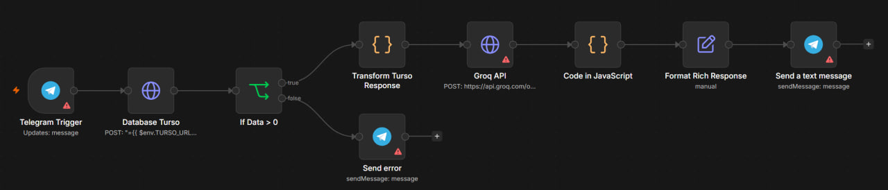
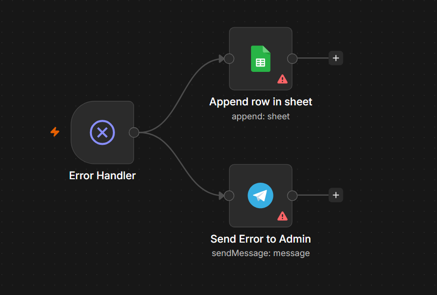

# Credit Scoring

Автоматизированный workflow для первичной оценки кредитного риска клиента в n8n.

## Описание

Workflow принимает имя клиента через Telegram, находит его в базе данных Turso, получает финансовые данные и передаёт их в LLM для оценки риска по заранее заданным правилам.

После обработки результат отправляется клиенту в Telegram и содержит:

- статус решения;
- уровень риска;
- причину решения;
- рекомендацию для менеджера.

Проект также содержит отдельный workflow для централизованной обработки ошибок.

## Workflow



Визуально workflow представляет собой цепочку узлов в стиле n8n:

- `Telegram Trigger` — получение имени клиента из Telegram
- `If Data > 0` — проверка наличия результатов в базе данных
- `Database Turso` — запрос данных клиента по имени
- `Transform Turso Response` — преобразование данных для LLM
- `Groq API` — запрос к LLM для оценки риска (Llama 3.3 70B)
- `Code in JavaScript` — парсинг JSON-ответа и формирование результата
- `Format Rich Response` — подготовка сообщения
- `Send a text message` — отправка результата клиенту в Telegram

Схема показывает, как данные проходят от Telegram-запроса через проверку БД и LLM-анализ к финальному ответу пользователю.

## Архитектура

Для каждого запроса система:

1. Получает имя клиента из Telegram-сообщения.
2. Проверяет, удалось ли найти клиента в базе Turso.
3. Извлекает финансовые параметры: зарплату, долг, статус занятости, наличие просрочек.
4. Трансформирует данные в структурированный формат для LLM.
5. Отправляет запрос к Groq API с системным prompt, содержащим правила оценки. В LLM передаются только необходимые для оценки финансовые данные без прямых идентификаторов клиента.
6. Получает от LLM структурированный JSON с решением, риском, обоснованием и рекомендацией.
7. Парсит ответ и обогащает его дополнительной информацией.
8. Формирует сообщение и отправляет клиенту в Telegram.

## Логика оценки

В текущей версии используются следующие правила:

| Условие | Результат |
|---|---|
| Клиент находится в чёрном списке | Отказ / высокий риск |
| Просрочка более 30 дней | Высокий риск |
| Долг превышает 50% месячного дохода | Средний риск |
| Клиент без работы или статус не указан | Повышенный риск |
| Остальные случаи | Надёжный клиент / низкий риск |

Правила оценки передаются LLM через системный prompt.

## Error Handler

Отдельный workflow предназначен для централизованной обработки ошибок n8n.



При ошибке система:

- `Error Handler` — перехватывает ошибки из других workflow'ов
- `Send Error to Admin` — отправляет уведомление администратору в Telegram с деталями ошибки
- `Append row in sheet` — записывает событие ошибки в Google Sheets для журнального учёта

В журнал сохраняются:

- дата и время возникновения ошибки;
- название workflow, где произошла ошибка;
- URL к execution в n8n;
- название узла, в котором произошла ошибка;
- полное сообщение об ошибке.

## Структура проекта

```text
credit-scoring/
├── docs/
│   ├── credit-scoring-workflow.png
│   └── error-handler-workflow.png
├── workflows/
│   ├── credit_scoring.json
│   └── error_handler.json
├── .gitignore
├── LICENSE
├── README.md
└── ...
```

## Используемые технологии

- n8n
- Telegram Bot API
- Turso
- Groq API
- Llama 3.3 70B
- Google Sheets
- JavaScript

## Запуск

1. Импортировать `credit_scoring.json` в n8n.
2. Настроить Telegram credentials.
3. Настроить подключение к Turso.
4. Настроить credentials для Groq API.
5. При необходимости импортировать `error_handler.json`.
6. Настроить Telegram Chat ID администратора.
7. Настроить Google Sheets для журнала ошибок.
8. Проверить структуру таблицы клиентов и используемые поля.

Credentials, токены и идентификаторы внешних ресурсов в workflow заменены на placeholders.

## Ограничения

- Это прототип автоматизированной оценки, а не полноценная банковская скоринговая система.
- Правила оценки находятся внутри prompt LLM, а не в отдельном детерминированном scoring engine.
- Поиск клиента выполняется по имени через `LIKE`, поэтому одинаковые или похожие ФИО могут привести к неоднозначному результату.
- Результат зависит от корректности ответа LLM и последующего JSON parsing.
- Workflow зависит от внешних сервисов Turso, Groq и Telegram.
- Не все полученные параметры клиента участвуют в явных правилах принятия решения.

## Назначение

Проект демонстрирует построение автоматизированного процесса оценки клиента в n8n с интеграцией базы данных, Telegram, LLM и централизованной обработкой ошибок.

